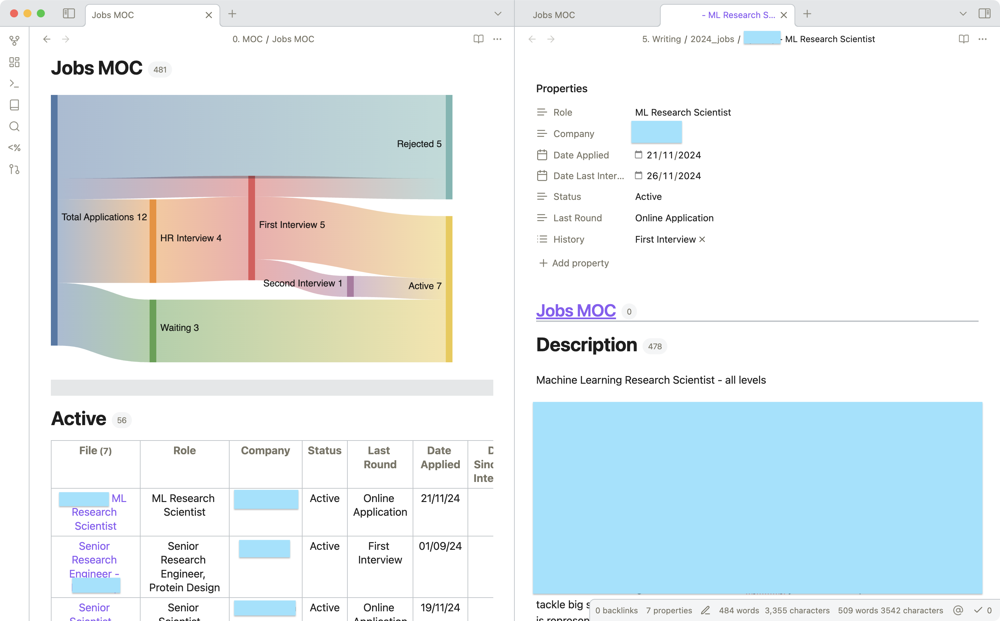

Hi! 

This is an example of how I got a very simple dashboard to work with Obsidian. 

You are to consider everything in this repository as a draft. Please do open pull requests and issues to chip in with your thoughts. 

Make sure to download and enable the plugins: Templater, Dataview.

